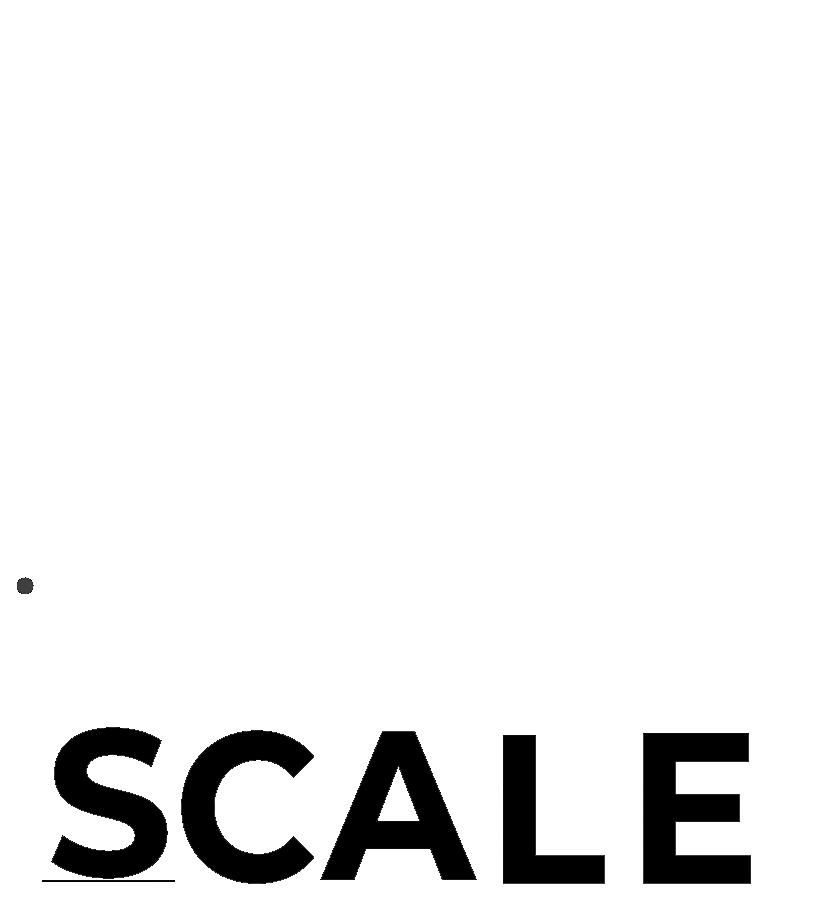

<p align="center">
    
</p>

<h1 align="center">Hi  I'm Israel</h1>
<h3 align="center">A truly passionate 😍 backend developer living in Montreal 🇨🇦</h3>
<p align="center">
    
    
    
</p>

<p>&nbsp;</p>


More than writing codes, I love creating, automating and integrating things. My passion for solving problems motivates me to dig into customer problems and solve them using innovative technology.

I'm currently working for the super-ultra-mega-amazing [@signifly](https://github.com/signifly) and I couldn't be happier!

In my spare time I also work as an Integration Engineer at [@GPSIntegrations](https://github.com/GPSIntegrations).

I speak <abbr title="English">🇬🇧</abbr> <abbr title="Portuguese">🇧🇷</abbr> <abbr title="Spanish">🇪🇸</abbr> and am trying my best to learn <abbr title="French">🇫🇷</abbr>!

<p>&nbsp;</p>

<h2 align="center">
  Where to find me? 🔗
</h2>

<p align="center">
    <a href="https://github.com/Israel5" target="_blank">
        
    </a>
    <a href="https://twitter.com/je_suis_israel" target="_blank">
        
    </a>
    <a href="https://www.linkedin.com/in/israel5" target="_blank">
        
    </a>
    <a href="https://instagram.com/TheWorldOfIsrael" target="_blank">
        
    </a>
</p>

<p>&nbsp;</p>

<p align="center">
    <h2>
        <picture>
            <source media="(prefers-color-scheme: dark)" srcset="assets/icons/scale_white.gif">
            <source media="(prefers-color-scheme: light)" srcset="assets/icons/scale_dark.gif">
            
        </picture>
        My GitHub Stats!
    </h2>
    <p align="center">
        <picture>
            <source media="(prefers-color-scheme: dark)" srcset="https://streak-stats.demolab.com/?user=Israel5&theme=monokai-metallian&hide_border=true&ring=A2FF0B&fire=DD2727">
            <source media="(prefers-color-scheme: light)" srcset="https://streak-stats.demolab.com/?user=Israel5&theme=buefy&hide_border=true">
            
        </picture>
    </p>
    <p align="center">
        <picture>
            <source media="(prefers-color-scheme: dark)" srcset="https://github-readme-activity-graph.vercel.app/graph/?username=Israel5&bg_color=1F222E&color=F8D866&line=F85D7F&point=A2FF0B&hide_border=true">
            <source media="(prefers-color-scheme: light)" srcset="https://github-readme-activity-graph.vercel.app/graph/?username=Israel5&bg_color=FFFFFF&color=7957D5&line=F8D866&point=FF3860&hide_border=true">
            
        </picture>
    </p>
    <p align="center">
        <picture>
            <source media="(prefers-color-scheme: dark)" srcset="https://github-readme-stats.vercel.app/api?username=Israel5&theme=omni&show_icons=true&title_color=F85D7F&bg_color=1F222E&hide_border=true">
            <source media="(prefers-color-scheme: light)" srcset="https://github-readme-stats.vercel.app/api?username=Israel5&theme=buefy&show_icons=true&hide_border=true">
            
        </picture>
        <picture>
            <source media="(prefers-color-scheme: dark)" srcset="https://github-readme-stats.vercel.app/api/top-langs/?username=Israel5&theme=omni&layout=compact&title_color=F85D7F&bg_color=1F222E&hide_border=true">
            <source media="(prefers-color-scheme: light)" srcset="https://github-readme-stats.vercel.app/api/top-langs/?username=Israel5&theme=buefy&layout=compact&hide_border=true">
            
        </picture>
    </p>
    <p align="center">
        <picture>
            <source media="(prefers-color-scheme: dark)" srcset="https://github-profile-trophy.vercel.app/?username=Israel5&column=6&theme=onedark&rank=SECRET,SSS,SS,S,AAA,AA,A,B,C">
            <source media="(prefers-color-scheme: light)" srcset="https://github-profile-trophy.vercel.app/?username=Israel5&column=6&theme=flat&rank=SECRET,SSS,SS,S,AAA,AA,A,B,C">
            
        </picture>
    </p>
</p>

<p>&nbsp;</p>

<details>
<summary><b>:zap:&nbsp;&nbsp;Recent Activity</b></summary>
<br/>

<!--START_SECTION:activity-->
<!--END_SECTION:activity-->

📊 **I have recently worked with:**

<!--START_SECTION:waka-->

```txt
PHP              6 hrs 50 mins   ███████████░░░░░░░░░░░░░░   43.93 %
Other            5 hrs 56 mins   █████████▓░░░░░░░░░░░░░░░   38.16 %
Blade Template   53 mins         █▒░░░░░░░░░░░░░░░░░░░░░░░   05.72 %
YAML             32 mins         █░░░░░░░░░░░░░░░░░░░░░░░░   03.49 %
Bash             27 mins         ▓░░░░░░░░░░░░░░░░░░░░░░░░   02.94 %
```

<!--END_SECTION:waka-->

</details>

<details>
  <summary><b>✨&nbsp;&nbsp;Work Experience</b></summary>
  <br/>

Find below the most relevant work experience as a developer:

[](https://www.signifly.com/)

**Backend Developer** \
[**Signifly**](https://www.signifly.com/) • Montreal, Canada \
Keywords: `Laravel`, `Postgres`, `Caching`, `Docker`, `TypeScript`, `NestJS`, `SQL Server`, `Forge`, `AWS`, `Digital Ocean`, `Vercel`, `Netlify`, `Software Architecture` \
<br/>

[](https://gpsintegrations.com/)

**Integration Engineer** \
[**GPS Integrations**](https://gpsintegrations.com/) • Online \
Keywords: `Laravel`, `Postgres`, `Redis`, `DynamoDB`, `AWS`, `DigitalOcean`, `Docker`, `TypeScript`, `JavaScript`, `REST`, `SOAP` \
<br/>

[](https://tagnull.com/)

**Software Engineer** \
[**Tagnull**](https://tagnull.com/) • Online \
Keywords: `Software architecture`, `Laravel`, `C++`, `Python`, `Database`, `CI/CD`, `Documentation`, `Integration` \
<br/>

[](https://project44.com/)

**Carrier Integrations Lead** \
[**project44**](https://project44.com/) • Online \
Keywords: `GPS integration`, `Documentation`, `Support`, `EDI` \
<br/>

[](https://fourkites.com/)

**International Operations, Product Support & Integrations Specialist** \
[**FourKites**](https://fourkites.com/) • Online \
Keywords: `PHP`, `Laravel`, `Postgres`, `MongoDB`, `Redis`, `Documentation`, `Support` \
<br/>

[](https://iqoption.com/)

**Customer Support** \
[**IQ Option**](https://iqoption.com/) • Saint Petersburg, Russia \
Keywords: `Customer Support`, `HTML` \
<br/>

[](https://ned.ie/)

**Software Developer** \
[**NED College**](https://ned.ie/) • Dublin, Ireland \
Keywords: `PHP`, `Laravel`, `MySQL`, `HTML`, `CSS`, `jQuery` \
<br/>

[](https://metrojornal.com.br/)

**Software Developer** \
[**Metro Jornal**](https://metrojornal.com.br/) • Sao Paulo, Brazil \
Keywords: `PHP`, `WordPress`, `MySQL`, `jQuery`, `Memcached`, `Shell script` \
<br/>

<br/>

</details>

<details>
    <summary><b>🔒&nbsp;&nbsp;SSH Public Key</b></summary>
    <br/>

```
ssh-rsa AAAAB3NzaC1yc2EAAAADAQABAAABgQDHWSEUvuRl76QZJs2IdMPu8mPjAsCIHar6IatacSHbUVcR/VAXRS5b43CEr7iFovWY9borZw6l8v9YG3IiHSA8Bd/kYvB+QtluBgcqZUn9m+MQPfCuFV/803OSPuGVTgF5R9WVKpIYUycAOiTsxDPNdwzhhD7MV2qc5R7AtwTdGmmfKGDFfwlrEINAzCAs8/Djcs6dhH9LbwJs0IydL6g5QMg1FpWeg/xrePsBDvuP1KpwXLmLvzgMQNwnK6kPa6qCuP+qjrzeAGCMQJ4jTFgIBlMALmy3Fwhk8W0q8gerv19xAsYQZJq0RUikvqKMg3EV01CGPWATSaiqF5tYBZFFmqHPDxQ06BDepm5mscLCigxK3TvhkYFHqZpdclvL1YQuSrvzWQs1GZamHcusITvzY0C9KHseaPvwsnz3McwfCev+Y1k8zhdRFaoTM0eI7Y4vcTRHB3aeZBZUhRkxliPbu05ELbGpbcnTm3h/W4pPMTIsQZE7rrkoonjo9CCesMs= israel@Israels-MacBook-Pro.local
```

</details>

<p align="center">
    <picture>
        <source media="(prefers-color-scheme: dark)" srcset="https://raw.githubusercontent.com/Israel5/Israel5/output/github-contribution-grid-snake-dark.svg">
        <source media="(prefers-color-scheme: light)" srcset="https://raw.githubusercontent.com/Israel5/Israel5/output/github-contribution-grid-snake.svg">
        
    </picture>
</p>

<p align="center">

```javascript
🔁(true) {
    🍲();
    😴();
    💻();
}
```

<p/>

<p align="center">
    
</p>
